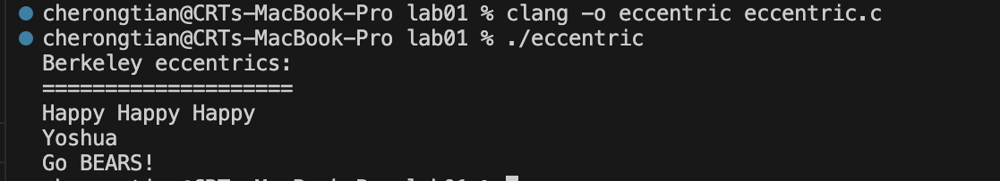
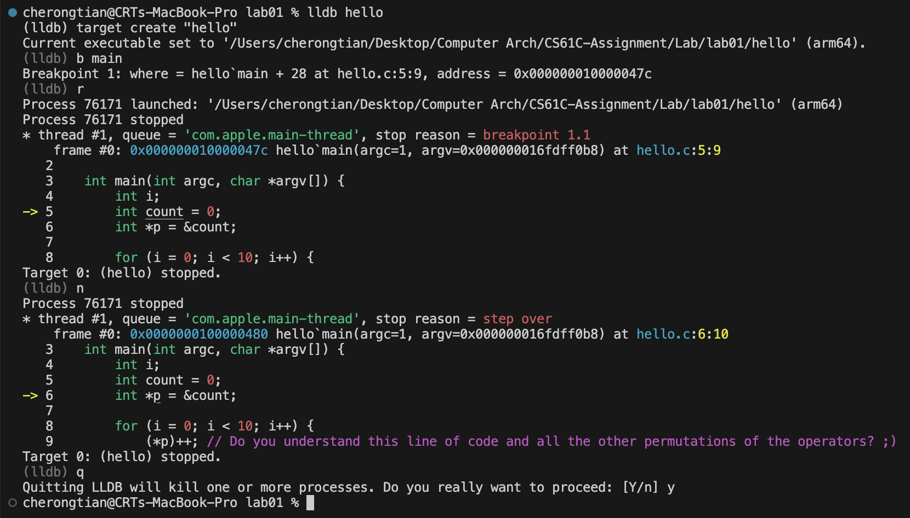
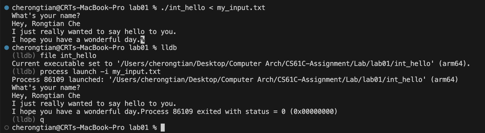
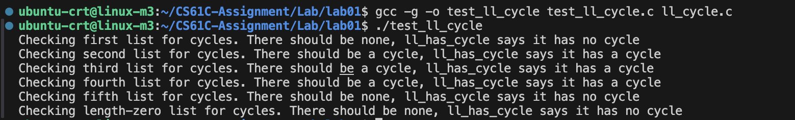

# CS61C Assignments Repository

## My Records
My answers would not be shown in the public repo, this fork functions as a milestone of my study.
- ✅ Lab00
- ✅ Lab01
   - **Exercise 01**

   - **Exercise 02**

   - **Exercise 03**

   - **Exercise 04** (to use valgrind, I switch to my Ubuntu VM as MacOS uses clang as default, but here gcc would be a better choice)
.png)
.png)
   - **Exercise 05**


### Overview
This repository contains all **labs**, and **projects** for the UC Berkeley CS61C course. It is designed to facilitate practice and deepen your understanding of the course material.

You can fork this repository to create your own working environment, track your progress, and store your solutions.

### Features
- **Labs:** Hands-on practice to strengthen core concepts.
- **Projects:** Large-scale assignments to apply knowledge in real-world scenarios.

### How to Use

#### 1. Fork the Repository
1. Go to the repository: [CS61C-Assignments](https://github.com/InsideEmpire/CS61C-Assignments).
2. Click the "Fork" button in the top-right corner of the page to create your own copy of the repository.

#### 2. Clone Your Forked Repository
1. Open your terminal or command prompt.
2. Clone your forked repository to your local machine:
   ```bash
   git clone https://github.com/<your-username>/CS61C-Assignments.git
   ```

#### 3. Work on Assignments
1. Navigate into the repository folder:
   ```bash
   cd CS61C-Assignments
   ```
2. Choose the directory for the assignment you want to work on (e.g., `hw01` for Homework 1):
   ```bash
   cd hw/hw01
   ```
3. Open the `.c` or `.h` files in your preferred text editor and start solving the problems!

---

### Notes
- Ensure you have the necessary tools installed, such as **gcc** or **clang** for compiling C code and a make tool for running tests.
- Use a text editor like VS Code, Sublime Text, or Vim for an enhanced coding experience.
- [Here](tools/tutorial.md) is a tutorial about how to set up an environment for Venus and Logisim. **Don't use the old `.jar` file that comes with Lab or Project.**

### Disclaimer
- This repository is **unofficial** and is not affiliated with or endorsed by UC Berkeley or the CS61C teaching team.
- All course materials and content are property of UC Berkeley CS61C staff and are provided here for **personal learning and practice** only. Please respect academic integrity policies.
